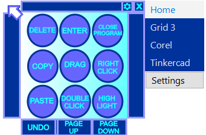

# AutoHotkey Clicker

Created for a client who accesses their computer using a joystick and a single switch, this simple AHK script allows users to perform more complex tasks and macros using a single mouse button/switch. Once started, the GUI is hidden by default and can be toggled with a button press/switch.

## Screenshot

## Installation and Usage

1. Install [AutoHotkey](https://www.autohotkey.com/)
2. Clone this project to your computer  
   `git clone https://github.com/ComputerWise/AHKClicker.git`
3. Open _AHKClicker.ahk_ or _AHKClicker_RB.ahk_

4. To activate:  
   _AHKClicker.ahk_: Hold left mouse  
   _AHKClicker_RB.ahk_: Right click
5. Enjoy!

## To Do

- Add more user settings such as shortcut combination
- Add context awareness for tabs
